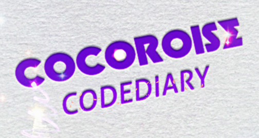

# CodeDiary

**代码**  
 ->用来放 🍋**代码**🍋

**博客**  
 ->用来放 🍒**博客**🍒，🍇**掘金**🍇，🍉**CDSN**🍉，🍆**知乎**🍆，到处收集到的奇怪的技术贴

**算法**  
 ->用来放 💓**算法**💓，目前主要是 ⚛️**剑指 OFFER**⚛️，之后考虑迁移之前做过的 ❇️**LeetCode**❇️ 题

---

> **Time** is the most important asset. Time does not equal money. Time equals life.  
>  And you only have one chance to make it right. Every human being is fighting a battle inside themselves. It’s your obligation to help and inspire them.  
> Regardless of what you do, you can always inspire others to do good. Nobody is better than you. And you’re not better than anybody else.  
> Be humble. Being in the comfort zone is wonderful, but nothing ever grows there.  
> Keep studying. Keep creating. Haters will come if you have the audacity to build something new. Don’t let them define you. Don’t let them stop you. Just block them and keep going.  
>  Don’t expect others to make you happy. You are the only one responsible for your happiness.  
> Don’t wait until friday to enjoy life. Joy should be present in everything you do.  
>  Be kind to your parents. They gave up many things for you. Having millions of people admiring you is worthless, if you’re not admired by your own family.  
>  Don’t fear the unknown. Fear knowing everything. Life is too damn short and every day counts. Do what you wanna do and do it now. Tick-tock don't stop. Tick-tock don't wait.  
>  -- by Zeno Rocha & Carol Moreschi.

---
